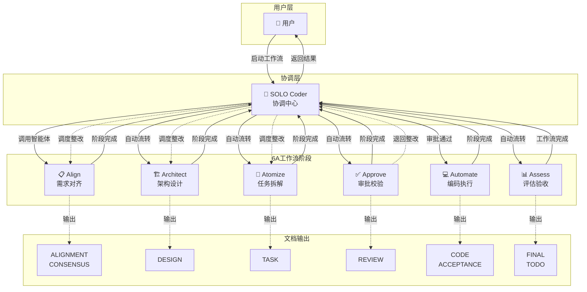
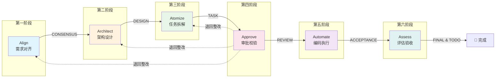
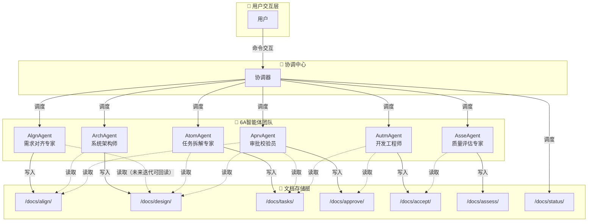
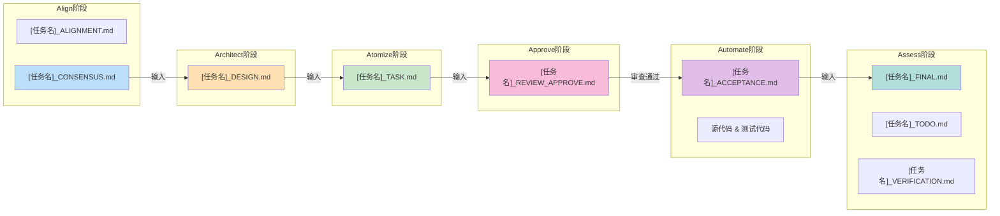

# 6A-Workflow README

**版本**：1.2.0  
**更新日期**：2026-04-12

## 更新日志

| 版本 | 日期 | 主要变更 |
|------|------|----------|
| 1.2.0 | 2026-04-12 | 整合模式说明章节；删除冗余示例；优化文档结构 |
| 1.1.0 | 2026-04-11 | 统一智能体命名规范；简化命令系统；添加版本信息 |
| 1.0.0 | 2026-03-01 | 初始版本，完成6A工作流核心设计 |

## 1. Workflow介绍

### 1.1 项目概述

本6A-Workflow是一套完整的多智能体协同方案，通过六个阶段的智能体团队协作，实现软件开发生命周期的规范化管理。方案采用协调中心模式，实现智能体间的高效协同。

6A工作流旨在解决软件开发过程中的需求管理、架构设计、任务分解、代码研发、质量控制等关键环节，通过标准化的流程和智能体协作，提升开发效率和质量。

### 1.2 智能体命名规范

智能体命名采用统一规范，详见[2.4 6A工作流阶段](#24-6a工作流阶段)。

**命名说明**：
- **智能体名称**：用于文档描述和内部标识，不带@符号
- **调用格式**：用于实际调用智能体，带@符号前缀

### 1.3 平台适配说明

6A工作流是一套通用的多智能体协同方法论，可适配多种AI开发平台。本文档以TraeCN平台为例进行说明，如需适配其他平台，请参考以下映射关系：

| 概念   | 说明                   | TraeCN实现示例            |
| ---- | -------------------- | --------------------- |
| 协调器  | 工作流协调中心，负责智能体调度和状态管理 | SOLO Coder            |
| 智能体  | 执行特定阶段任务的AI代理        | AlgnAgent、ArchAgent等 |
| 命令前缀 | 触发协调器的标识符            | @SOLO-Coder           |
| 文档通信 | 智能体间通过文档进行通信         | Markdown文件            |

> **适配其他平台**：只需将文档中的"SOLO Coder"替换为目标平台的协调器名称，将"@SOLO-Coder"替换为对应的命令格式即可。

## 2. 核心设计理念

### 2.1 协调中心模式

- **统一入口**：所有用户交互必须通过工作流协调器进行
- **状态驱动**：基于统一的状态文档进行阶段转换
- **文档通信**：智能体之间通过文档进行通信，避免直接调用

> **实现示例**：在TraeCN平台中，协调器实现为"SOLO Coder"，用户通过`@SOLO-Coder`命令与协调器交互。其他平台可实现等效的协调器角色。

### 2.2 工作流自动化

- **一键启动**：用户只需通过SOLO Coder启动工作流
- **自动流转**：根据状态文档自动管理阶段转换
- **实时监控**：提供工作流状态和进度的实时反馈

### 2.3 6A管理理念

6A代表六个关键阶段（详见[1.2 智能体命名规范](#12-智能体命名规范)），体现了软件开发的完整生命周期管理理念：

- **Align**：确保需求的准确性和一致性，避免后期变更
- **Architect**：建立稳固的系统架构，为后续开发奠定基础
- **Atomize**：将复杂任务分解为可执行的原子单元
- **Approve**：在设计阶段完成后统一审批，确保需求、架构、任务的完整性和一致性
- **Automate**：高效执行开发任务，确保代码质量
- **Assess**：全面评估项目成果，确保交付质量

6A理念强调阶段隔离、文档驱动、灵活审批、状态管理和安全保障，通过规范化的流程确保软件开发的高效和高质量。

### 2.4 6A工作流阶段

| 阶段 | 智能体 | 调用格式 | 核心任务 | 输出文档与路径 |
|------|--------|----------|----------|----------------|
| Align | 需求对齐专家 AlgnAgent | @AlgnAgent | 分析项目上下文、梳理需求边界、澄清歧义、生成共识文档 | ALIGNMENT、CONSENSUS → /docs/align/ |
| Architect | 系统架构师 ArchAgent | @ArchAgent | 基于共识文档进行分层设计、模块划分、接口定义 | DESIGN → /docs/design/ |
| Atomize | 任务拆解专家 AtomAgent | @AtomAgent | 将架构设计转化为可执行的原子任务，梳理依赖关系 | TASK → /docs/tasks/ |
| Approve | 审批校验员 AprvAgent | @AprvAgent | 校验需求分析、架构设计、任务拆解成果的完整性和一致性 | REVIEW → /docs/approve/ |
| Automate | 开发工程师 AutmAgent | @AutmAgent | 按任务依赖顺序实现代码，编写测试，记录进度 | 业务代码、测试代码、ACCEPTANCE → /src、/tests、/docs/accept/ |
| Assess | 质量评估专家 AsseAgent | @AsseAgent | 验证执行结果、评估项目质量、生成总结报告和待办清单 | FINAL、TODO、VERIFICATION → /docs/assess/ |

## 3. 6A工作流架构图

> **平台适配说明**：以下架构图以TraeCN平台为例，展示6A工作流的协同架构。其他平台可实现等效的协调器和智能体团队，核心流程和文档通信机制保持一致。

### 3.1 整体流程架构



### 3.2 阶段依赖关系图



### 3.3 智能体协同架构



### 3.4 文档流转关系图



## 4. 目录结构

```
ai4self/
└── prompt/
    └── 6A-workflow/                 # 6A工作流提示词目录
        ├─ 6a-workflow.rules           # 合并后的全局协调规则（精简格式）
        ├─ 6A-code-align-prompt.md     # 需求对齐专家提示词
        ├─ 6A-code-architect-prompt.md # 系统架构师提示词
        ├─ 6A-code-atomize-prompt.md   # 任务拆解专家提示词
        ├─ 6A-code-approve-prompt.md   # 审批校验员提示词
        ├─ 6A-code-automate-prompt.md  # 开发工程师提示词
        └─ 6A-code-assess-prompt.md    # 质量评估专家提示词
```

## 5. 快速开始

> **命令格式说明**：以下命令示例使用TraeCN平台的`@SOLO-Coder`格式。其他平台请使用对应的协调器调用方式，命令逻辑保持一致。

### 5.1 平台配置（以TraeCN为例）

6A工作流需要在AI开发平台中进行相应配置。以下以TraeCN平台为例说明配置步骤：

**TraeCN平台规则配置：**

6a-workflow规则合并了总控规则和协调规则，定义了完整的工作流规则和智能体协调逻辑：

**配置步骤：**

1. 点击左侧菜单的「规则和技能」→ 进入规则管理页
2. 新建项目规则，命名为「6a-workflow」
3. 将 `6a-workflow.rules` 文件中的内容复制粘贴到规则内容中
4. 保存规则配置

**规则文件位置：**
`6a-workflow.rules`

### 5.2 配置智能体

将所有6A智能体文件导入到Trae自定义智能体中：

**配置步骤：**

1. 点击左侧菜单的「智能体管理」→ 进入智能体管理页「新建智能体」
2. 将当前目录下的所有提示词文件按照提示词和应用场景依次导入：
   - 6A-code-align-prompt.md（需求对齐专家）
   - 6A-code-architect-prompt.md（系统架构师）
   - 6A-code-atomize-prompt.md（任务拆解专家）
   - 6A-code-approve-prompt.md（审批校验员）
   - 6A-code-automate-prompt.md（开发工程师）
   - 6A-code-assess-prompt.md（质量评估专家）
3. **重要提示**：智能体的中文名称和英文名称必须保持一致，建议不要使用自动生成功能，而是从智能体文档中手动复制粘贴的方式创建

**智能体文件位置：**
当前目录（`ai4self/prompt/6A-workflow/`）

### 5.3 配置验证

配置完成后，验证所有组件是否正常工作：

**验证命令：**

```
@SOLO-Coder
理解当前6A工作流规则与约束，明确当前工作流模式是什么？
```

如果配置成功，协调器会返回当前工作流模式（auto/manual）和可用命令列表。

### 5.4 启动工作流

**推荐格式**：

```
@SOLO-Coder
严格按照6A工作流，采用[模式]模式，实现需求[需求描述]
```

**示例**：

```
@SOLO-Coder
严格按照6A工作流，采用人工模式，实现需求开发用户管理模块
```

**简化格式**（适用于已设置模式的场景）：

```
@SOLO-Coder
启动工作流 [任务名]
```

示例：

```
@SOLO-Coder
启动工作流 开发用户管理模块
```

### 5.5 监控状态

```
@SOLO-Coder
查看状态
```

### 5.6 工作流模式与审批

6A工作流支持**自动模式**和**人工模式**两种审批模式，用户必须明确设置工作流模式，系统不会默认使用任何模式。

#### 模式说明

| 模式 | 别名 | 审批机制 | 适用场景 |
|------|------|----------|----------|
| **auto** | 快速模式 | 所有阶段自动流转，无需审批 | 简单项目、快速开发、原型验证 |
| **manual** | 严格模式 | 仅Approve阶段需用户审批，其他阶段自动流转 | 复杂项目、关键系统、需要质量控制 |

#### 审批流程

- **auto模式**：所有阶段自动流转，无需用户干预
- **manual模式**：
  1. Align、Architect、Atomize阶段完成后自动流转
  2. Approve阶段完成后，SOLO Coder会提示"等待审批"
  3. 用户必须手动运行`审批通过`命令进行审批
  4. 审批通过后，工作流自动进入Automate阶段
  5. Automate、Assess阶段完成后自动流转

> **重要提示**：`审批通过`命令只能由用户手动执行，智能体禁止执行审批命令。审批操作会记录在全局状态文档中。

#### 模式设置命令

| 命令 | 说明 |
|------|------|
| `使用自动模式` / `开启快速模式` | 设置为自动模式 |
| `使用人工模式` / `开启严格模式` | 设置为人工模式 |
| `当前工作流模式是什么` | 查看当前工作流模式 |
| `审批通过` | manual模式下审批Approve阶段 |

#### 完整工作流示例

```
@SOLO-Coder
使用人工模式
@SOLO-Coder
启动工作流 创建2048合成小游戏
...（Approve阶段完成后）
@SOLO-Coder
审批通过
```

### 5.7 歧义处理机制

当智能体遇到需求歧义或多种实现方案时，会自动进行决策并继续执行，不暂停工作流：

**处理流程：**

1. 智能体发现歧义或多种方案
2. 生成问题报告文档：`[任务名]_QUESTIONS_[阶段名].md`
3. 智能体自主选择推荐方案（标注为"自动决策"），生成答案文档：`[任务名]_ANSWERS_[阶段名].md`
4. 智能体基于自动决策结果继续执行，不暂停工作流
5. 如用户对自动决策不满意，可在后续阶段提出异议

**问题报告格式：**

- **必须澄清的问题**：影响项目进展的关键决策
- **可选优化的问题**：不影响核心功能的优化选择
- **方案对比**：提供多种方案的优缺点对比

### 5.8 中文名称支持

6A工作流支持中文名称与SOLO交流，各智能体的中文名称详见[1.2 智能体命名规范](#12-智能体命名规范)。

所有命令都支持中英文名称混合使用，例如：

```
@SOLO-Coder
启动工作流 开发用户管理模块
```

```
@SOLO-Coder
查看状态
```

```
@SOLO-Coder
审批通过
```

## 6. 状态管理机制

### 6.1 全局状态文档

- **路径**：`/docs/status/GLOBAL_STATUS.md`
- **内容**：工作流模式、当前任务、任务列表、整体进度
- **更新频率**：任务启动、阶段转换、任务完成时更新

**全局状态文档模板：**

```markdown
# 全局状态文档

## 工作流模式
模式: [auto/manual]  # 必填，无默认值

## 当前任务
任务名: [任务名]
当前阶段: [阶段名]

## 任务列表
| 序号 | 任务名 | 状态 | 当前阶段 |
|-----|-------|-----|---------|
| 1 | [任务名] | 进行中/已完成 | [阶段名] |

## 审批记录
| 阶段 | 状态 | 审批方式 | 时间 |
|-----|-----|---------|-----|
| Approve | 待审批 | - | - |
```

**重要说明：**
- `模式`字段为必填项，无默认值，必须在启动工作流前明确设置
- 智能体在阶段启动时会强制校验此字段，缺失时将暂停并提示用户设置

### 6.2 任务状态文档

- **命名格式**：`[任务名]_STATUS.md`
- **存储路径**：`/docs/status/`
- **内容**：阶段进度、审批状态、输出文档
- **更新频率**：每个阶段完成后自动更新

**任务状态文档模板：**

```markdown
# [任务名] 状态文档

## 基本信息
- 工作流模式：auto/manual
- 当前阶段：[阶段名]
- 整体进度：[x/6]

## 阶段进度
| 阶段 | 状态 | 开始时间 | 完成时间 | 输出文档 |
|-----|-----|---------|---------|---------|
| Align | 已完成 | 2024-01-01 10:00 | 2024-01-01 11:00 | ALIGNMENT.md, CONSENSUS.md |
| Architect | 已完成 | 2024-01-01 11:00 | 2024-01-01 12:00 | DESIGN.md |
| Atomize | 已完成 | 2024-01-01 12:00 | 2024-01-01 13:00 | TASK.md |
| Approve | 已批准 | 2024-01-01 13:00 | 2024-01-01 14:00 | REVIEW.md |
| Automate | 进行中 | 2024-01-01 14:00 | - | - |
| Assess | 待启动 | - | - | - |

## 审批记录
| 阶段 | 审批方式 | 审批时间 | 审批结果 |
|-----|---------|---------|---------|
| Approve | 人工 | 2024-01-01 14:00 | 通过 |

## 问题记录
- [时间] [阶段] 问题描述 → 解决方案
```

### 6.3 状态流转机制

- **流转规则**：
  - Align → Architect → Atomize → Approve：自动流转
  - Approve → Automate：manual模式需审批，auto模式自动流转
  - Automate → Assess：自动流转
- **审批状态**：待审批 / 已批准 / 已拒绝（仅Approve阶段）
- **问题处理**：QUESTIONS/ANSWERS机制（智能体自主选择推荐方案，标注为"自动决策"，不暂停工作流）

### 6.4 核心原则

- **阶段隔离**：各阶段职责明确，互不干扰
- **文档驱动**：所有通信通过Markdown文档进行
- **灵活审批**：支持auto/manual两种模式，仅Approve阶段需审批
- **状态管理**：全局/任务状态文档实时更新
- **安全保障**：审批记录可追溯

### 6.5 问题文档处理流程

当智能体遇到需求歧义或多种实现方案时，会通过问题文档进行自动决策：

1. 智能体生成问题报告文档（`[任务名]_QUESTIONS_[阶段名].md`）
2. 智能体自主选择推荐方案（标注为"自动决策"），生成答案文档（`[任务名]_ANSWERS_[阶段名].md`）
3. 智能体基于自动决策结果继续执行，不暂停工作流
4. 如用户对自动决策不满意，可在后续阶段提出异议

**问题报告格式：**

- **必须澄清的问题**：影响项目进展的关键决策
- **可选优化的问题**：不影响核心功能的优化选择
- **方案对比**：提供多种方案的优缺点对比

## 7. 故障排除

### 7.1 常见问题

1. **智能体调用失败**：
   - 检查智能体文件是否存在于Agent目录
   - 确认智能体命名是否正确
   - 验证智能体文件格式是否符合规范
2. **状态文档更新失败**：
   - 检查文档路径权限
   - 验证文档格式是否正确
   - 确认SOLO Coder有读写权限
3. **工作流无法自动流转**：
   - 检查状态文档是否正确更新
   - 确认审批状态是否已记录
   - 验证阶段顺序是否正确
4. **Approve审查退回后如何恢复**：
   - 查看REVIEW审查报告中的退回目标阶段和整改要求
   - 由SOLO Coder调度对应阶段智能体执行整改
   - 整改完成后Approve阶段自动重新校验
5. **Assess阶段发现严重问题如何回退**：
   - 查看QUESTIONS_ASSESS文档中的问题等级和回退建议
   - 由用户决策是否回退及回退目标阶段
   - 回退后由SOLO Coder调度对应智能体执行整改
6. **歧义处理卡住如何恢复**：
   - 查看对应阶段的QUESTIONS文档确认歧义内容
   - 智能体会自动选择推荐方案并生成ANSWERS文档继续执行
   - 如对自动决策不满意，可在后续阶段提出异议
7. **工作流中断后如何从断点恢复**：
   - 使用 `查看状态` 命令查看当前状态
   - 读取全局状态文档和任务状态文档确认断点位置
   - 使用 `恢复工作流` 命令恢复执行

## 8. 最佳实践

### 8.1 配置管理

**方案/思路：**

- 将配置文件纳入版本控制系统（如Git），确保配置变更可追溯
- 定期备份配置文件到独立存储位置，防止意外丢失
- 在测试环境验证配置有效性后再应用到生产环境

**好处/收益：**

- **可追溯性**：配置变更历史清晰，便于问题定位和回滚
- **安全性**：备份机制确保配置不会因误操作而丢失
- **稳定性**：测试验证降低配置错误导致的生产事故风险

### 8.2 性能优化

**方案/思路：**

- 在会话开始时预加载配置和状态文档，减少运行时读取延迟
- 缓存频繁访问的状态信息，避免重复读取文件系统
- 合并多个小操作为批量操作，减少智能体调用次数和上下文切换

**好处/收益：**

- **响应速度提升**：预加载和缓存机制显著减少I/O等待时间
- **资源消耗降低**：减少文件系统访问和智能体调度开销
- **用户体验改善**：批量处理使工作流执行更加流畅

### 8.3 安全注意事项

**方案/思路：**

- 限制配置文件的读写权限，仅授权必要的人员和进程访问
- 不在配置文件中存储敏感信息（如API密钥、密码），使用环境变量或密钥管理服务
- 记录关键操作的审计日志，包括配置变更、审批操作等

**好处/收益：**

- **访问控制**：权限限制防止未授权访问和篡改
- **敏感信息保护**：避免敏感数据泄露风险，符合安全合规要求
- **审计追踪**：日志记录支持安全事件调查和合规审计

### 8.4 启动场景最佳实践

#### 场景一：自动模式启动

```
@SOLO-Coder
请严格按照6A工作流，采用自动模式，实现需求：
（1）XXXX，
（2）XXX；
约束：
（1）XXXX，
（2）XXX；
我不希望继续介入决策，由你自己按照合理方案来决策；
执行修改完毕后进行测试，并反馈测试结果。
```

**适用场景**：需求明确、技术方案成熟、原型开发、POC验证

#### 场景二：人工模式启动

```
@SOLO-Coder
请严格按照6A工作流，采用人工模式，实现需求：
（1）XXXX，
（2）XXX；
约束：
（1）XXXX，
（2）XXX；
遇到冲突由你自己提供主选和备选方案；
由人工来干预和决策。
```

**适用场景**：复杂项目、关键系统开发、需要严格质量控制

### 8.5 会话恢复最佳实践

#### 场景三：重启会话恢复任务

**交互方式：**

```
@SOLO-Coder
请检查当前项目的任务状态并反馈。
```

**示例响应：**

```
SOLO-Coder：正在读取全局状态文档...
SOLO-Coder：发现未完成的任务：开发用户管理模块
SOLO-Coder：当前阶段：Architect（架构设计）
SOLO-Coder：已完成阶段：Align
SOLO-Coder：下一步操作：继续执行Architect阶段
用户：请继续执行
SOLO-Coder：继续执行工作流...
```

**好处：**

- **快速恢复上下文**：用户无需重新描述需求，直接从断点继续
- **减少重复工作**：避免重复执行已完成的阶段
- **提高效率**：快速定位当前进度，节省时间
- **增强可追溯性**：状态文档记录了完整的执行历史

## 9. 总结

本6A-Workflow方案是一套通用的多智能体协同方法论，通过协调中心模式实现了工作流的自动化管理和优化。方案充分考虑了智能体协同的技术约束，通过文档通信和统一协调，显著提升了用户体验和工作效率。

本文档以TraeCN平台为例进行说明，6A工作流可适配其他支持多智能体协同的AI开发平台。核心的六阶段流程（Align→Architect→Atomize→Approve→Automate→Assess）和文档驱动机制具有平台无关性，可根据具体平台特性进行适配实现。

实施后，用户将能够通过简单的命令启动和管理整个6A工作流，减少手动操作和文档管理的负担，同时确保流程的规范性和质量控制。这将使6A工作流真正成为一个高效、可靠的软件开发协同平台。
